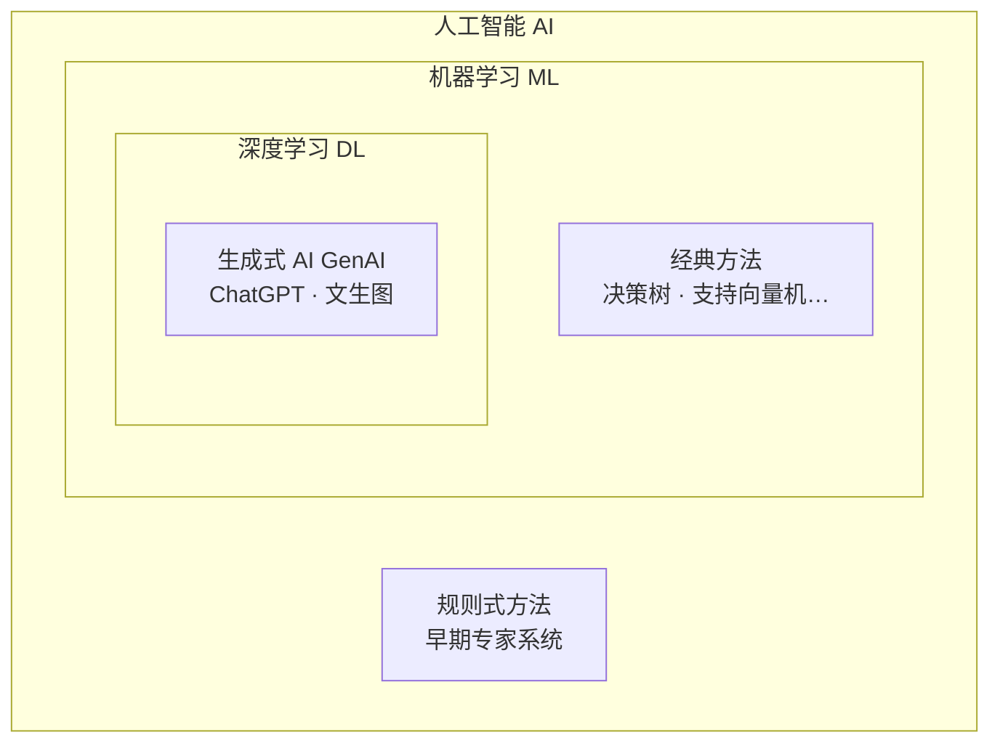

> [!abstract] 本课将学到
>
> - 人工智能（Artificial Intelligence）到底是什么
> - 「机器学习 Machine Learning」和「教小孩认猫」有什么关系
> - AI、机器学习、深度学习、生成式 AI 的关系（一张图看懂）
> - **亲手在网页里训练一个最简单的模型**，体验「训练」到底发生了什么

## 一、你早就被 AI 包围了

先别管教科书上的定义。看看你的一天：

- 早上拿起手机，相册自动把昨天的照片按「人物」「风景」分类好了——这是 AI 在**认图**
- 刷短视频，越刷越对胃口——这是 AI 在**猜你喜欢**
- 打字时输入法自动联想出下一句话——这是 AI 在**预测文字**
- 拍照翻译、语音助手、导航软件预估到达时间……全都是 AI

> [!tip] 一个反直觉的事实
> 这些东西没有一个长得像电影里的机器人。**AI 不是「人造的人」，而是「从数据里找规律的程序」。**

## 二、「找规律」是什么意思？—— 教小孩认猫

想想我们怎么教一个两岁的小孩认识「猫」？

我们不会给他讲「猫是哺乳纲食肉目猫科动物……」，而是：

1. 指着一只猫说：「这是猫 🐱」
2. 再指一只：「这也是猫」
3. 小孩见到狗，喊「猫！」→ 我们纠正：「不对，那是狗 🐶」
4. 看过几十次之后，小孩就能自己认出从没见过的猫了

**注意最后一步**：小孩认出的是他*没见过*的那只猫。这说明他学到的不是「背下那几十张图片」，而是**猫的规律**。

机器学习（Machine Learning）做的事一模一样：

| 教小孩认猫              | 机器学习            |
| ----------------------- | ------------------- |
| 给小孩看的猫/狗照片     | **数据 Data**       |
| 「这是猫/这是狗」的纠正 | **标签 Label**      |
| 小孩脑子里的判断能力    | **模型 Model**      |
| 看照片 + 被纠正的过程   | **训练 Training**   |
| 认出从没见过的猫        | **预测 Prediction** |

把这五个词记住，你已经掌握了机器学习的一半词汇量。

## 三、一张图看清 AI 家族

新闻里经常混着用 AI、机器学习、深度学习……它们到底是什么关系？一句话：**大圈套小圈**。

- **人工智能（Artificial Intelligence, AI）**：最大的圈。一切「让机器表现出智能」的努力都算。
- **机器学习（Machine Learning, ML）**：AI 中的一派。核心思想是*不写死规则，让机器自己从数据中学*。
- **深度学习（Deep Learning, DL）**：机器学习中的一种技术。用多层神经网络，是这十年 AI 爆发的发动机。
- **生成式 AI（Generative AI, GenAI）**：深度学习中能「创造内容」（写文章、画图）的那部分。ChatGPT 就属于这里。

> [!example] 用家族比喻记忆
> AI 是「家族姓氏」，ML 是「这一支人」，DL 是这一支里的「天才少年」，GenAI 是这位天才少年最近做出的「惊艳作品」。

## 四、亲手训练一个模型！

说了这么多，不如亲手来一次。下面的演示框里，你要做一件真实的事：**训练一个模型来区分「猫」和「狗」**。

<iframe src="/static/widgets/perceptron.html" class="widget-frame" style="height:560px"></iframe>

试着这样玩：

1. 直接点「▶ 开始训练」，看直线如何一步步调整位置，直到把两类点分开
2. 点「清空重来」，自己放点——故意放得乱七八糟一点，看它还能不能分开
3. 思考：如果「猫」和「狗」的点完全混在一起，直线还有办法吗？

刚才发生的事情，本质上和 ChatGPT 的训练**是同一个原理**：

> [!important] 你刚刚经历了什么？
>
> 1. 你放置的点 = **数据**
> 2. 那条可以移动的直线 = **模型**（它的位置由几个可调的数字决定，这些数字就叫**参数 Parameters**）
> 3. 「开始训练」后程序不断检查分错的点、微调参数 = **训练**（背后是一个叫**感知机 Perceptron** 的经典算法）
> 4. 最终那条自动找到的直线 = 学到的**规律**
>
> ChatGPT 有几千亿个参数，调整的也是这些「旋钮」——只不过数量多到天文数字，原理却一脉相承。

## 五、AI 能做什么、不能做什么

**现在做得很好的：**

- 图像识别（人脸、医学影像）
- 文字理解与生成（翻译、写作、问答）
- 预测（天气、股价趋势、设备故障）
- 推荐系统（购物、视频）

**目前做不到或很困难的：**

- 真正的理解与意识——它是在算概率，不是在思考
- 极少样本的学习——人类看一眼就会，AI 往往要海量数据
- 可靠的逻辑推理——会一本正经地胡说八道（幻觉 Hallucination）

> [!warning] 别神化也别妖魔化
> AI 是一个强大但机械的工具。理解它的边界，比背诵它的神话更重要。

## 六、本章英文小词典

| 英文                         | 中文      | 一句话记忆                            |
| ---------------------------- | --------- | ------------------------------------- |
| Artificial Intelligence (AI) | 人工智能  | artificial 人造的 + intelligence 智能 |
| Machine Learning (ML)        | 机器学习  | machine 机器 + learning 学习          |
| Deep Learning (DL)           | 深度学习  | deep 指「很多层」的神经网络           |
| Generative AI                | 生成式 AI | generate 生成 → 能创造新内容的 AI     |
| Data                         | 数据      | 学习的原材料                          |
| Label                        | 标签      | 数据的「标准答案」                    |
| Model                        | 模型      | 学到的规律本体                        |
| Training                     | 训练      | 调整参数的过程                        |
| Parameter                    | 参数      | 模型内部可调的「旋钮」                |
| Prediction                   | 预测      | 用学到的规律回答新问题                |

## 七、自测一下

> [!question]- 1. 手机相册把照片自动分成「人物」「风景」，这个过程里什么是数据？什么是模型？
> **照片本身是数据**；相册里那个负责分类的程序（它内部学到的东西）就是模型。它先在海量标注照片上完成训练，再用学到的规律来处理你的新照片。

> [!question]- 2. 「机器学习」和传统编程最本质的区别是什么？
> 传统编程：**人写出规则**，程序执行规则处理数据。机器学习：**人提供数据和答案**，机器自己找出规则。一个是给方法，一个是给范例让它悟方法。

> [!question]- 3. ChatGPT 属于 AI、ML、DL、GenAI 中的哪个圈子？（多选）
> 全部四个都对！它是用**深度学习**（DL）方法训练的**生成式**（GenAI）语言模型，当然也属于机器学习（ML）和人工智能（AI）。这就是「大圈套小圈」的含义。

## 下一步

直觉已经建立，接下来去拿工具箱——先补数学，或者先学 Python 都可以：

→ [[prerequisites/math/index|📐 数学基础目录]] · [[prerequisites/python/index|🐍 Python 目录]] · [[roadmap|🗺 回看路线图]]
