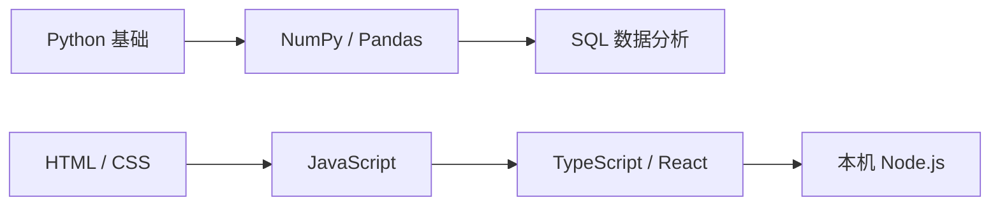

> [!abstract] 从“看懂代码”走到“独立完成项目”
> 编程学院包含 **Python 与数据（16 课）**、**SQL（6 课）**、**Web 开发（22 课）**。建议按顺序学习，也可以根据目标选择一条路线。

<iframe src="/static/labs/progress.html" class="widget-frame code-lab-progress" style="height:240px" title="编程学院本机学习进度"></iframe>

## 三条学习路线

- **[Python 与数据](/prerequisites/python/)**：适合 AI、自动化与数据分析学习者，不要求编程前置。
- **[SQL 数据库](/programming/sql/)**：学习查询和分析结构化数据，建议先完成 Python P1–P5 或具备同等基础。
- **[Web 开发](/programming/web/)**：从网页结构一路学到 React 与本机 Node.js，不要求编程前置。

## 如何使用 Code Lab

每课先运行默认代码，再完成分步任务。代码、完成状态和最近学习位置保存在浏览器本机；没有账号，也不会上传代码。Python 数据包首次使用需要联网下载。Node.js、真实爬虫、文件自动化和外部 API 项目会明确要求在本机环境完成。

## W3Schools 对照资源

本站课程为原创中文内容。以下链接用于查阅参考手册和补充练习：

| 主题                         | W3Schools 官方资源                                                                                                                             |
| ---------------------------- | ---------------------------------------------------------------------------------------------------------------------------------------------- |
| Python                       | [Python Tutorial](https://www.w3schools.com/python/)                                                                                           |
| NumPy / Pandas               | [NumPy](https://www.w3schools.com/python/numpy/) · [Pandas](https://www.w3schools.com/python/pandas/)                                          |
| SQL                          | [SQL Tutorial](https://www.w3schools.com/sql/)                                                                                                 |
| HTML / CSS / JavaScript      | [HTML](https://www.w3schools.com/html/) · [CSS](https://www.w3schools.com/css/) · [JavaScript](https://www.w3schools.com/js/)                  |
| TypeScript / React / Node.js | [TypeScript](https://www.w3schools.com/typescript/) · [React](https://www.w3schools.com/react/) · [Node.js](https://www.w3schools.com/nodejs/) |
| Git                          | [Git Tutorial](https://www.w3schools.com/git/)                                                                                                 |

> [!note] 独立性与版权说明
> 本站不是 W3Schools 官方合作项目，不代表或隶属于 W3Schools。本站不镜像、不批量翻译其教程；外部页面的内容、账户和隐私政策由 W3Schools 负责。
