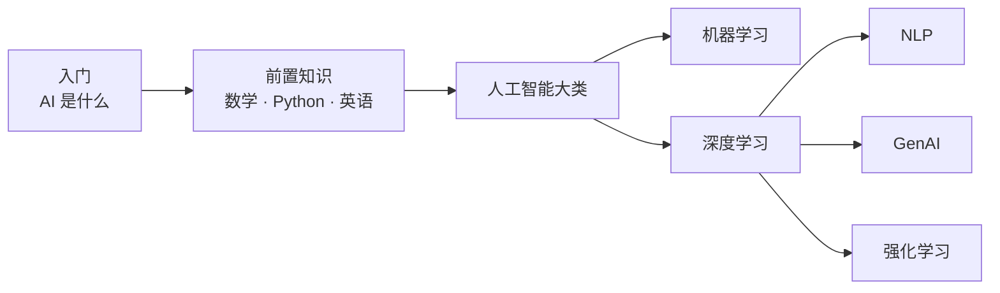

> [!abstract] 怎么用这张路线图？
> 学习就像爬山，不需要一口气登顶——**每次走一小段就好**。下面的路线分为几个阶段，每个阶段都建立在你已经学过的内容之上。带 ✅ 的课程已完成，🚧 表示正在编写中。

## 全景图

## 阶段一：入门（建立直觉）

| #   | 课程                                             | 状态 |
| --- | ------------------------------------------------ | ---- |
| 0   | [[getting-started/what-is-ai\|什么是人工智能？]] | ✅   |

## 阶段二：前置知识（打磨工具）

**数学**（[[prerequisites/math/index|目录]]）—— 不必全部学完再往下走，学到「导数」就可以开始碰机器学习：

| #   | 课程                        | 状态 |
| --- | --------------------------- | ---- |
| M1  | 数与式：从加减乘除说起      | 🚧   |
| M2  | 方程与不等式                | 🚧   |
| M3  | 函数：机器之间的对应关系    | 🚧   |
| M4  | 指数与对数：增长的数学      | 🚧   |
| M5  | 三角函数初步                | 🚧   |
| M6  | 导数：变化的速度            | 🚧   |
| M7  | 梯度下降：AI 训练的核心引擎 | 🚧   |
| M8  | 向量与矩阵：数据的语言      | 🚧   |
| M9  | 概率：不确定性的度量        | 🚧   |
| M10 | 统计初步：从样本猜整体      | 🚧   |

**Python**（[[prerequisites/python/index|目录]]）：

| #   | 课程                          | 状态 |
| --- | ----------------------------- | ---- |
| P1  | 安装你的第一个编程环境        | ✅   |
| P2  | 变量与数据类型                | ✅   |
| P3  | 列表、字典：装数据的容器      | ✅   |
| P4  | 条件判断与循环                | ✅   |
| P5  | 函数：把重复的事打包          | ✅   |
| P6  | 类与对象初识                  | ✅   |
| P7  | NumPy：数字的瑞士军刀         | ✅   |
| P8  | Pandas：像 Excel 一样处理表格 | ✅   |
| P9  | Matplotlib：让数据开口说话    | ✅   |
| P10 | 实战：分析一份真实数据集      | ✅   |

**AI 英语**（[[prerequisites/english/index|目录]]）：

| #   | 课程                        | 状态 |
| --- | --------------------------- | ---- |
| E1  | AI 术语的词根词缀密码       | ✅   |
| E2  | 高频术语 100 词（中英对照） | ✅   |
| E3  | 如何读懂一篇英文教程/文档   | ✅   |
| E4  | 论文阅读入门                | ✅   |

## 阶段三：人工智能大类

以下板块同属「人工智能」大类（网站目录 `ai/`），按推荐顺序排列。

### 神经网络伴学（3Blue1Brown）

**[[ai/nn/3blue1brown/index|目录]]** —— 神经网络系列 4 集的中文导读 + 交互演示，是进入深度学习前最好的直觉铺垫：

| #   | 课程                   | 状态 |
| --- | ---------------------- | ---- |
| B1  | 但什么是神经网络？     | ✅   |
| B2  | 梯度下降，网络如何学习 | ✅   |
| B3  | 反向传播在做什么？     | ✅   |
| B4  | 反向传播的微积分       | ✅   |

### 机器学习

| #    | 课程                         | 状态 |
| ---- | ---------------------------- | ---- |
| ML1  | 什么是机器学习？             | 🚧   |
| ML2  | 线性回归：画一条最合适的线   | 🚧   |
| ML3  | 分类问题与逻辑回归           | 🚧   |
| ML4  | 过拟合与欠拟合：学习的分寸   | 🚧   |
| ML5  | 决策树与随机森林             | 🚧   |
| ML6  | 支持向量机 SVM               | 🚧   |
| ML7  | 聚类：没有标签怎么分组       | 🚧   |
| ML8  | 特征工程：喂给模型什么很重要 | 🚧   |
| ML9  | 模型评估：怎么知道它学得好   | 🚧   |
| ML10 | 项目实战：预测房价           | 🚧   |

### 深度学习

| #    | 课程                         | 状态 |
| ---- | ---------------------------- | ---- |
| DL1  | 神经元：大脑灵感的数学模型   | 🚧   |
| DL2  | 反向传播：网络如何自我纠错   | 🚧   |
| DL3  | PyTorch 初体验               | 🚧   |
| DL4  | 全连接网络实战               | 🚧   |
| DL5  | 卷积神经网络 CNN：看图的眼睛 | 🚧   |
| DL6  | 图像分类项目实战             | 🚧   |
| DL7  | 循环神经网络 RNN：处理序列   | 🚧   |
| DL8  | 注意力机制 Attention         | 🚧   |
| DL9  | Transformer：一切的基石      | 🚧   |
| DL10 | 迁移学习与预训练模型         | 🚧   |
| DL11 | 大模型的诞生：Scaling Laws   | 🚧   |
| DL12 | 深度学习调参经验谈           | 🚧   |

### 三大方向

**自然语言处理 NLP**（[[ai/nlp/index|目录]]）：[[ai/nlp/tokenization|分词与表示]] → [[ai/nlp/word-embedding|词向量]] → [[ai/nlp/text-classification|文本分类]] → [[ai/nlp/sequence-labeling|序列标注]] → [[ai/nlp/machine-translation|机器翻译]] → [[ai/nlp/bert|BERT]] → [[ai/nlp/gpt-family|GPT 家族]] → [[ai/nlp/prompt-engineering|提示词工程]]（共 8 课，全部 ✅）

**生成式 AI GenAI**（[[ai/genai/index|目录]]）：什么是生成式 AI → 语言模型原理 → RAG 检索增强 → AI Agent → 扩散模型与图像生成 → 多模态 → 微调与部署 → 安全与伦理（共 8 课）

**强化学习 RL**（[[ai/rl/index|目录]]）：什么是强化学习 → 马尔可夫决策过程 → Q-Learning → 策略梯度 → AlphaGo 的故事 → RLHF 与大模型对齐（共 6 课）

## 附属板块：青年大学习

**[[qingnian/index|青年大学习]]**：按学期整理每期主题要点与题目答案。属于 L2 级内容——答案全部标注出处，无法确认的明确标「待验证」。

**[[qingnian/ac-wiki/index|Ac-Wiki 镜像]]**：开源项目 [Ac-Wiki](https://github.com/Ac-Wiki/Ac-Wiki) 的本地完整镜像（CC BY 4.0）——校园生活、学术资源、通识技能、考研真题等 70 余篇大学生实用知识，与主题团课整理互补。

## 附录

- [[appendix/glossary|术语表]] —— 全部术语中英对照速查
- [[appendix/formulas|公式速查卡]]
- [[appendix/resources|学习资源汇总]]

> [!tip] 给不同目标读者的建议
>
> - **只想看懂 AI 新闻**：阶段一 + NLP/GenAI 的前几课就够了
> - **想动手做项目**：数学学到 M7，Python 学完，直接进机器学习
> - **想考研/深造**：全路线 + 每课的延伸阅读都要啃
